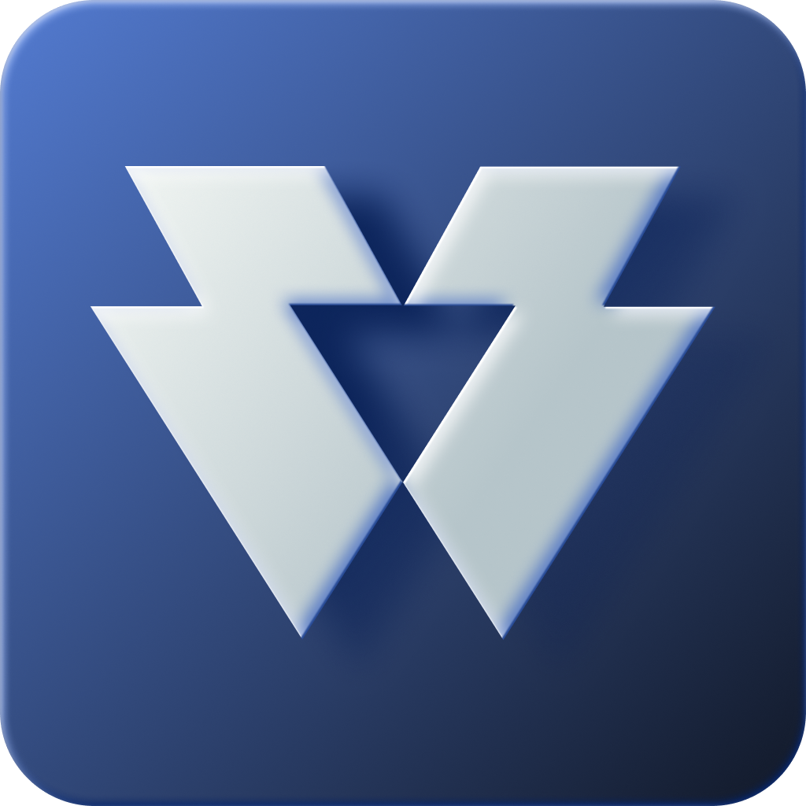
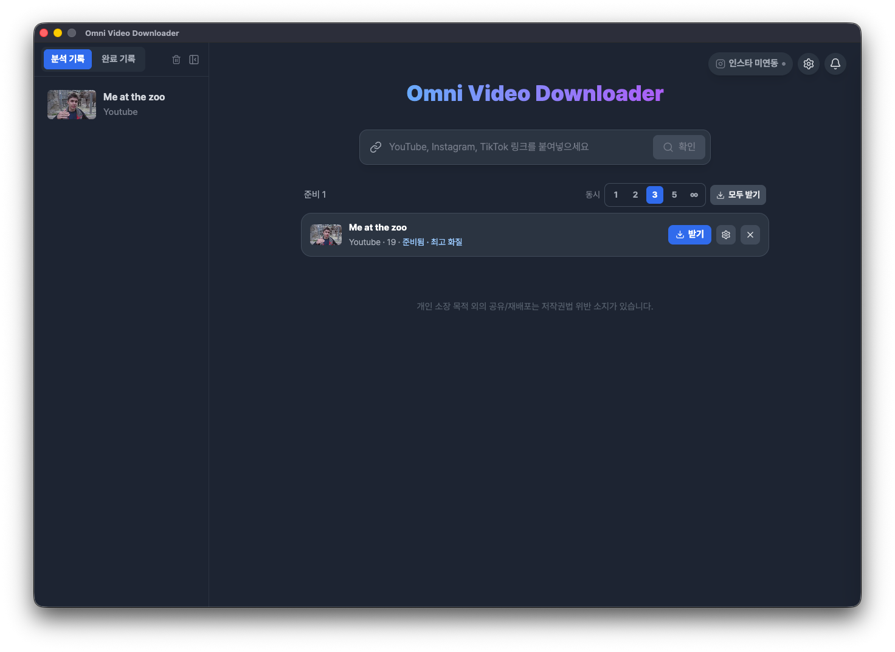

# Omni Video Downloader

**YouTube · Instagram · TikTok 영상을 클릭 몇 번으로 저장하는 데스크톱 앱**

원하는 화질로 영상을, MP3로 음원을, 자막이 없는 영상은 AI 음성 인식으로 대본까지.
macOS · Windows 지원 · 100% 무료

### ⬇️ [**최신 버전 다운로드 →**](https://github.com/thoven-jun/omni-video-downloader-releases/releases/latest)

---

---

## ✨ 이런 걸 할 수 있어요

- 🎬 **영상 다운로드** — 최고화질(원본) · 4K · QHD · FHD · HD 중 선택
- 🎵 **음원 추출** — MP3 · M4A · WAV, 썸네일(앨범아트) 자동 삽입
- 🖼️ **썸네일만 저장** — 영상 없이 표지 이미지(JPG)만
- 📝 **자막·대본 추출** — 자막이 있으면 SRT, **없으면 AI 음성 인식(STT)으로 대본 생성**
- 🌐 **크롬 확장 연동** — 영상 페이지에서 버튼 한 번이면 앱이 알아서 분석
- 📋 **클립보드 자동 감지** — 링크만 복사하면 앱이 바로 인식
- 📥 **여러 개 동시 다운로드** — 대기열로 한 번에 여러 영상
- 🔒 **인스타그램 계정 연동** — 앱 안에서 로그인해 본인이 볼 수 있는 콘텐츠 접근
- 🔄 **자동 엔진 업데이트** — 플랫폼이 바뀌어도 다운로드 엔진을 최신으로 유지

## 🎯 지원 플랫폼

| 플랫폼 | 지원 범위 |
|--------|-----------|
| **YouTube** | 일반 영상 · Shorts |
| **Instagram** | 게시물(피드) · 릴스 |
| **TikTok** | 영상 · 카로셀 |

## ⬇️ 다운로드 & 설치

> 최신 설치 파일은 항상 [**Releases 페이지**](https://github.com/thoven-jun/omni-video-downloader-releases/releases/latest)에 있습니다.

### 🪟 Windows

1. `Omni Video Downloader-Setup-x.x.x-win-x64.exe` 다운로드
2. 실행 후 설치 (설치형)
   - 설치 없이 쓰고 싶다면 `...-Portable-...exe` 버전 사용
3. "Windows의 PC 보호" 파란 창이 뜨면 → **추가 정보 → 실행**
   - 배포 인증서를 붙이지 않은 개인 앱이라 표시되는 정상 경고입니다.

### 🍎 macOS

1. `Omni Video Downloader-x.x.x-mac-universal.dmg` 다운로드 (Apple Silicon · Intel 겸용)
2. dmg를 열고 앱을 **Applications 폴더로 드래그**
3. 처음 실행 시 **"확인되지 않은 개발자" 경고**가 뜹니다. 아래 방법으로 엽니다:
   - 응용 프로그램에서 앱을 **우클릭 → 열기 → 열기**
   - 또는 **시스템 설정 → 개인정보 보호 및 보안** → 하단의 **"확인 없이 열기"** 클릭

> ⚠️ 이 앱은 Apple 유료 개발자 서명이 없어 위 과정이 필요합니다. 앱 자체는 안전하며, 소스는 검증 가능한 오픈 배포입니다.
> 그래도 열리지 않으면, **앱을 먼저 응용 프로그램 폴더에 넣은 뒤** dmg에 함께 들어 있는 **`Click Me to Fix`** 파일을 더블클릭하세요.
> 격리 속성을 제거하고 내부 엔진 실행 권한을 복구합니다. (실행 시 맥 로그인 비밀번호를 입력하라고 물어봅니다.)

## 🚀 사용법

### 기본 다운로드

1. 앱을 열고 영상 링크를 **붙여넣기** (또는 링크 복사만 해도 자동 감지)
2. 분석이 끝나면 **다운로드 설정** 창에서 선택:
   - **유형** — 영상 / 오디오
   - **화질** 또는 **포맷** (MP3 · M4A · WAV)
   - **함께 받기** — 썸네일 · 자막·대본
3. **다운로드** 클릭 → 완료

### 🧩 크롬 확장으로 더 빠르게

브라우저에서 보던 영상을 바로 앱으로 보낼 수 있습니다.

1. [`omni-chrome-extension.zip`](https://github.com/thoven-jun/omni-video-downloader-releases/releases/latest) 다운로드 후 압축 해제
2. Chrome 주소창에 `chrome://extensions` 입력
3. 우측 상단 **개발자 모드** 켜기
4. **압축 해제된 확장 프로그램을 로드합니다** → 압축 푼 폴더 선택
5. 이제 YouTube · Instagram · TikTok 영상 화면에 **다운로드 버튼**이 생깁니다.
   버튼을 누르면 Omni 앱이 열리며 자동으로 분석을 시작합니다.

### 📝 자막·대본 추출

- 자막 트랙이 있는 영상은 **SRT 자막 파일**로 저장됩니다.
- 자막이 없는 영상(인스타 릴스, 틱톡 등)은 **AI 음성 인식(Whisper)** 으로 대본을 만들어 `_script.txt`로 저장합니다.
  - 첫 사용 시 음성 인식 모델을 한 번 내려받습니다(정확도별 선택 가능).
  - 음성을 분석하는 과정이라 영상 길이에 따라 시간이 걸릴 수 있습니다.

### 🔒 인스타그램 계정 연동 (선택)

본인 계정으로 볼 수 있는 콘텐츠를 받으려면 **설정 → 계정**에서 앱 내 로그인을 진행하세요.
로그인 정보는 이 기기 안에서만 사용되며 외부로 전송되지 않습니다.

## ❓ 자주 묻는 질문

<b>맥에서 "손상되었거나 개발자를 확인할 수 없다"고 나와요</b>

Apple 유료 서명을 붙이지 않은 개인 배포 앱이라 나타나는 정상 경고입니다.
응용 프로그램에서 앱을 **우클릭 → 열기**, 또는 **시스템 설정 → 개인정보 보호 및 보안 → "확인 없이 열기"** 로 실행하세요.
그래도 안 되면 **앱을 응용 프로그램 폴더에 넣은 뒤** dmg 안의 `Click Me to Fix`를 더블클릭하세요. (맥 로그인 비밀번호를 물어봅니다.)
격리 속성 제거와 다운로드 엔진 권한 복구를 한 번에 처리합니다.

<b>백신/윈도우가 위험하다고 경고해요</b>

배포 인증서(코드 서명)를 붙이지 않아 일부 백신이 "알 수 없는 게시자"로 표시할 수 있습니다.
**추가 정보 → 실행**으로 진행하면 됩니다.

<b>다운로드가 갑자기 안 돼요 / 분석이 실패해요</b>

플랫폼이 내부 구조를 바꾸면 다운로드 엔진 업데이트가 필요합니다.
앱을 재시작하면 최신 엔진 업데이트를 안내하며, 앱 자체 업데이트는 [Releases 페이지](https://github.com/thoven-jun/omni-video-downloader-releases/releases/latest)에서 최신 버전을 받아 해결할 수 있습니다.

<b>업데이트는 어떻게 하나요?</b>

- **Windows**: 새 버전이 나오면 앱이 알려주고, 동의하면 자동으로 설치·재시작합니다.
- **macOS**: 새 버전 알림이 뜨면 [Releases 페이지](https://github.com/thoven-jun/omni-video-downloader-releases/releases/latest)에서 새 dmg를 받아 덮어써 주세요.

## 🐞 버그 제보

앱에서 오류가 나면 **알림 센터의 "제보" 버튼**으로 바로 보낼 수 있습니다.
개인정보 보호를 위해 사용자 경로·URL 등은 자동으로 가려진 채 전송됩니다.

## ⚖️ 사용 시 유의사항

- 이 앱은 **개인적인 백업·오프라인 시청 등 정당한 용도**를 위한 도구입니다.
- 다운로드한 콘텐츠의 **저작권은 원저작자에게 있습니다.** 재배포·상업적 이용은 저작권 침해가 될 수 있습니다.
- 각 플랫폼의 서비스 약관을 확인하고 **본인 책임 하에** 사용하세요.

---

**Omni Video Downloader** · Made by [thoven-jun](https://github.com/thoven-jun)

[개인정보처리방침](PRIVACY.md) · [버그 제보 / 문의](https://github.com/thoven-jun/omni-video-downloader-releases/issues)

